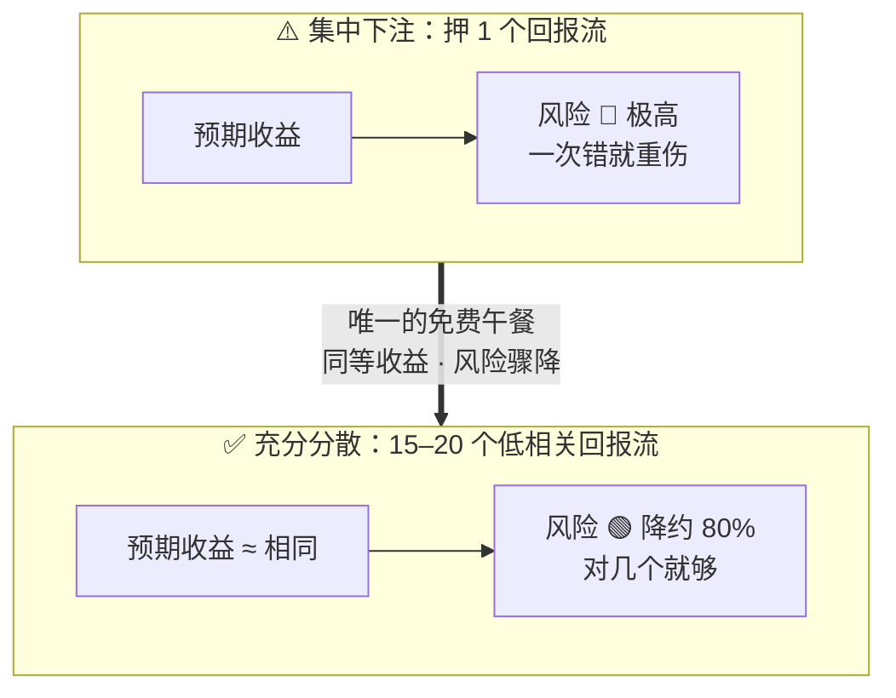

# 🎯 投资原则

> 知道了 [[02 ⚙️ 经济机器怎么运转]] 之后，怎么下注。核心不是预测对，而是**构建一个预测错了也不会死的组合**。

---

## 🏆 圣杯（The Holy Grail）

> Dalio 研究了**数千个历史案例**后发现：投资里唯一的免费午餐是**分散化**。

- 如果你把 15–20 个**彼此不相关**的回报流组合在一起，可以在不降低预期收益的前提下，把风险降低约 **80%**。〔来源：Dalio《Principles》/《经济机器》中「Holy Grail of Investing」〕
- 这就是「圣杯」：**找到多个不相关的回报来源，而不是押注单一资产/单一观点。**



⚠️ **误区**：买 10 只同涨同跌的股票 ≠ 分散。它们在危机时相关性趋近 1。真正的分散是跨**资产、国家、货币、驱动因子**。

---

## ⚖️ 风险平价（Risk Parity）

**一句话**：按**风险贡献**分配权重，不是按钱。

- 传统 60/40 股债组合里，股票波动大，贡献了 ~90% 的风险——看似分散，实际满仓押股票。
- 正确做法：让每类资产对组合的风险贡献大致相等。波动大的资产配少点，波动小的配多点。
- 机构对低波的债券加杠杆来拉平风险；**个人不能加杠杆**，见下方约束。

---

## 🌤️ 全天候（All Weather）

> 不预测未来，而是构建一个**任何季节都不会亏太多**的组合。

| | 通胀↓ | 通胀↑ |
|---|---|---|
| **增长↑** | 股票、信用债 | 股票、商品、黄金 |
| **增长↓** | 长久期国债 | 黄金、商品 |

四种环境各占 ~25% 风险预算。谁赢谁输不重要，组合永远有资产在涨。

> 战术上可以对当前所处 [[04 🔄 短期债务周期]] / [[05 ⏳ 长期债务周期]] 位置做超/低配，但这部分要单独记，不混进全天候底仓。

---

## 🇨🇳 个人版约束（我的现实）

券商限制：**不能加杠杆、不能做空、不能买期权、不能直接买国债/实物金**。

所以用这些替代路径：
- **黄金暴露**：不能买金条 → 用**紫金矿业（黄金+铜）** + 黄金股 ETF。
- **长久期债券对冲**：不能买长债 → 用**现金（¥850 万）本身**当低波缓冲。
- **美元分散**：港股（联系汇率）天然带美元暴露。
- **股票风险**：A 股波动大 → 按风险贡献下调个股仓位，而非按钱等权。

---

## 🥇 为什么重仓黄金

把前面几页串起来：
- [[05 ⏳ 长期债务周期]] → 美国债务 40 万亿、实际利率 > 实际增长、财政主导压顶。
- 黄金是**货币信用的对冲物**，与实际利率负相关。
- 在滞胀、信用危机环境表现最好——正是当前长周期后段的剧本。
- Dalio 家办 75% 押 GLD；个人建议 10–20%。

---

## 🧠 原则清单（每次决策对照）

1. 先判断经济机器在哪个周期阶段，再谈买卖。
2. 不预测单一事件，建任何环境都能活的组合。
3. 至少 15 个低相关回报流；合并同因子下注。
4. 现金不是垃圾，但长期持有现金会被通胀偷走——黄金+分散才是真安全。
5. **每次决策前，先写下决策准则**（凭什么这么决定 → 赌哪个变量 → 什么情况认错 → 到点机械执行）。模板见下方「📝 决策准则外化」。
6. 复盘只问：对在哪/错在哪/下次改什么；原则被反复证伪就改原则。

**认知偏差警示**：过度自信、近因效应、确认偏误、把 Beta 当 Alpha、同因子重复下注、损失厌恶、锚定成本。

---

## 📝 决策准则外化（Dalio 做法）

> Dalio 原话精神："**Every time I make a decision, I write down the criteria I used to make that decision.** After the outcome is known, I evaluate whether it was a good decision *given those criteria*, then I improve the criteria."
>
> 翻译：**每次做决策，先把"我凭什么这么决定"写下来。** 结果出来后，对照当时写的准则判断——是准则错了，还是执行错了——然后升级准则。

为什么必须**事前**写、不能事后补：

| 好处 | 大白话 |
|---|---|
| **可审计** | 事后能分清：是判断错了（准则问题），还是没按计划做（执行问题）。不会一笔糊涂账 |
| **可迭代** | 同一准则被证伪 2–3 次就改掉。你的原则清单就是从这些记录里长出来的 |
| **情绪无处藏** | 写下来的那一刻你没法骗自己——"我是在按纪律加仓"还是"我被跌怕了想抄底"，一写就现形 |
| **决策可复制** | 下次遇到同样场景，翻记录直接照做，不用重新纠结 |

### 📇 决策卡模板（每次一笔）

```
📅 时间：        （写具体日期，别写"近期"）
🎯 决策：        （买/卖/不动 + 仓位数字，必须是可执行动作）
🌍 周期定位：    （当前在短/长债务周期哪个阶段？滞胀？衰退？）
🔮 我赌的变量：  （最多 3 个，写清楚方向）
📋 用的准则：    （引用上面的原则编号，比如 #1、#5）
🛑 认错条件：    （什么情况发生 = 我错了，必须行动。要可观测、可量化）
📌 验证节点：    （什么时候回看这个决策）
```

### 📝 示例：美联储加息后，紫金矿业要不要减？

```
📅 时间：        2026-09-29
🎯 决策：        维持紫金矿业 30.4% 仓位不动，不加不减。
                 若金价跌破 4000 且实际利率见顶信号出现（10Y TIPS 连续
                 2 个月回落 / 长债拍卖投标倍数显著恶化），加仓至 35%。
🌍 周期定位：    长期债务周期后段 + 滞胀期。名义 10Y 5.27%（20年新高），
                 实际利率 ~2.4% 高位，但 实际利率 > 实际增速 不可持续。
🔮 我赌的变量：  ① 财政主导最终把实际利率压回低位（10年主线）；
                 ② 央行购金托底，中国已连续 22+ 个月；
                 ③ 美联储 9 月加息在 Dalio 剧本内，不是新信息。
📋 用的准则：    #1 周期定位、#2 不赌单事件、#4 现金被通胀偷走、
                 #5 决策准则外化（本卡）。
🛑 认错条件：    出现"强劲财政整顿"情景：美国加税+砍支出立法落地，
                 或实际利率维持 2.5%+ 超过 12 个月且央行购金连续
                 3 个月停滞 → 减回 20%，不再等。
📌 验证节点：    每月 15 日查：10Y TIPS、国债拍卖投标倍数、央行购金月报。
                 2026-12-31 正式复盘本卡。
```

> 💡 写"认错条件"是这张卡最难、也最值钱的一步。Dalio 说：**"Be open-minded, but not so open-minded that your brain falls out."**（要开放，但不能开放到脑子都掉了）——认错条件就是防止你"脑子掉了"的护栏。

---

## 🔗 链到
- [[02 ⚙️ 经济机器怎么运转]] — 一切的起点
- [[03 📈 生产率长期增长]] — 长期持有生产率上升的资产
- [[04 🔄 短期债务周期]] — 战术判断的依据
- [[05 ⏳ 长期债务周期]] — 为什么要配黄金对冲
